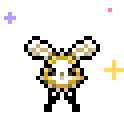
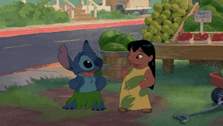

<!--
  ✿ art credits ✿ (hi future me, this is where all the cute things come from)

  assets/sailor-bee.gif · assets/moon.gif · assets/bee.gif · assets/hibiscus.gif · assets/divider.png
    original pixel art drawn for this profile (sailor moon *inspired*, nothing traced or copied)

  assets/mew.gif · assets/mew-sleep.gif
    Mew sprite animations ("Pose" + "EventSleep") by JFain, from the PMD Sprite Collab
    https://sprites.pmdcollab.org/#/0151
    https://github.com/PMDCollab/SpriteCollab/tree/master/sprite/0151
    license: CC BY-NC 4.0 · https://creativecommons.org/licenses/by-nc/4.0/
    changes: cropped, re-timed, white sticker outline + sparkles / z's added, scaled 4x (nearest neighbour)
    Mew is © Nintendo / Creatures Inc. / GAME FREAK inc. (non-commercial fan use)

  assets/cutiefly.gif
    Cutiefly "Idle" sprite animation by baronessfaron, Mitsubachi and Emmuffin, from the PMD Sprite Collab
    https://sprites.pmdcollab.org/#/0742
    https://github.com/PMDCollab/SpriteCollab/tree/master/sprite/0742
    license: CC BY-NC 4.0 · https://creativecommons.org/licenses/by-nc/4.0/
    changes: cropped, re-timed, white sticker outline + sparkles added, scaled 4x (nearest neighbour)
    Cutiefly is © Nintendo / Creatures Inc. / GAME FREAK inc. (non-commercial fan use)

  assets/stitch.gif · assets/stitch-hula.gif
    from Disney's official GIPHY channel (https://giphy.com/disney): oCsBDE7QQ77HO and mVJpyylkUvu9ixSmbL
    stitch.gif: background removed, sticker outline, blink + hop loop · stitch-hula.gif: resized
    Lilo & Stitch is © Disney
    rebuild: python3 tools/make_stickers.py <folder with the downloads>

  media/about-me/ · the intro video, made with HyperFrames (every source it uses is listed in media/about-me/README.md)

  stats card: github-readme-stats · https://github.com/anuraghazra/github-readme-stats

  ⭐ star + 📦 download counts are a hand-written snapshot from 2026-10-01
     (downloads = pypi + crates.io + docker hub + github release assets)
  📝 the blog list is refreshed daily by .github/workflows/blog-posts.yml
-->

  
  
  

<h1 align="center">hello world, i'm autumn (bee) </h1>

<samp>✦ in the name of the moon, i'll decrypt you! ✦</samp>

<!-- bio: a centred pyramid. each line is ~70px narrower than the one above it in GitHub's font
     (Mona Sans 14px: 741 → 674 → 601 → 534 → 455 → 379 → 310 → 238 → 158px), so re-measure after edits -->

she/her · systems engineer 2 @ amazon web services · previously cisco, duo security &amp; monzo · tokyo / london 🌏 
i made <a href="https://github.com/bee-san/RustScan">RustScan</a>, <a href="https://github.com/bee-san/Ciphey">Ciphey</a>, <a href="https://github.com/bee-san/pyWhat">pyWhat</a>, <a href="https://github.com/bee-san/Name-That-Hash">Name-That-Hash</a> &amp; <a href="https://github.com/Jayy001/Search-That-Hash">Search-That-Hash</a> · 50k+ ⭐ &amp; 4M+ downloads ⚡ 
and these days i make cute tools for learning languages: 日本語 · ʻōlelo hawaiʻi · ภาษาไทย 🌺 
graduated in computer science (with honours!) from the university of liverpool 🎓 
at <a href="https://tryhackme.com">tryhackme</a>: employee #4 · ex-#2 in the world · ex-subreddit lead 🎖️ 
and og discord mod: grew it from 5k → 300k members 👾 
<a href="https://github.com/gchq/CyberChef">cyberchef</a> maintainer · spoke at black hat eu 🎤 
<a href="https://skerritt.blog/acing-the-worlds-hardest-cyber-security-exam-with-3-days-of-study/">speedran the CISSP in just 3 days</a> 🏁 
i blog at <a href="https://skerritt.blog">skerritt.blog</a> 🌸

  <a href="https://skerritt.blog"><kbd>📝 read my blog</kbd></a>&nbsp;
  <a href="https://x.com/bee_sec_san"><kbd>🐦 @bee_sec_san</kbd></a>&nbsp;
  <a href="https://www.linkedin.com/in/autumnskerritt/"><kbd>💼 linkedin</kbd></a>

<!-- about-me video: 30s intro made with HyperFrames, source + rebuild steps in media/about-me/ -->

   
  ▶ <a href="media/about-me/out/about-me.mp4">watch my 30-second intro</a> (mp4, 1080p) · made with <a href="https://hyperframes.heygen.com/">hyperframes</a> · <a href="media/about-me">source</a>

<h3 align="center">🏅 badges collected</h3>

<samp>gotta catch 'em all ✦</samp>

<table align="center">
  <tr>
    <td width="50%" valign="top">⚡ <b>50k+ ⭐ &amp; 4M+ downloads</b> ciphey, rustscan, pywhat &amp; the hash tools</td>
    <td width="50%" valign="top">🛡️ <b><a href="https://github.com/open-source/github-secure-open-source-fund/projects">github secure open source fund</a></b> 2026 cohort, with ciphey</td>
  </tr>
  <tr>
    <td valign="top">🏛️ <b>1 of 35 invited to the downing street hackathon</b> <a href="https://luma.com/9vr0zktj">no. 10's hackathon</a>, picked from 1,500 applicants</td>
    <td valign="top">🏆 <b>won 9 hackathons</b> hackathon queen 👑</td>
  </tr>
  <tr>
    <td valign="top">🐉 <b>4 of my tools ship in kali linux</b> rustscan, ciphey, name-that-hash &amp; pywhat</td>
    <td valign="top">🧑‍🍳 <b>cyberchef maintainer</b> gchq's cyber swiss army knife, 36k ⭐</td>
  </tr>
  <tr>
    <td valign="top">🎤 <b>spoke at black hat</b> ciphey @ black hat arsenal europe 2024</td>
    <td valign="top">🐛 <b>found a cvss 9.6 critical rce</b> 4 anki cves, disclosed with cisco talos</td>
  </tr>
  <tr>
    <td valign="top">🏁 <b><a href="https://skerritt.blog/acing-the-worlds-hardest-cyber-security-exam-with-3-days-of-study/">speedran the cissp in 3 days</a></b> "the world's hardest cyber security exam"</td>
    <td valign="top">🚀 <b>tryhackme employee #4</b> ex-#2 in the world · grew the discord 5k → 300k</td>
  </tr>
  <tr>
    <td colspan="2" align="center" valign="top">🌺 <b>the first open-source hawaiian dictionaries</b> and i added hawaiian + welsh to yomitan</td>
  </tr>
</table>

<h3 align="center">🌙 my many phases</h3>

<samp>15k+ contributions since 2015, and every phase of the moon 🌑 → 🌗</samp>

<table align="center">
  <tr>
    <td align="center">🌑 2015–16</td>
    <td><b>hello world</b> · first repos: little python scripts, flash cards, a morse code text-to-speech. started learning hawaiian on duolingo 🌺</td>
  </tr>
  <tr>
    <td align="center">🌒 2017–19</td>
    <td><b>uni girl</b> · computer science at liverpool on a gchq cyberfirst bursary, hackathons, <a href="https://github.com/bee-san/tldr-News">tl;dr news</a>, two books, and <b>ciphey is born</b> (july 2019)</td>
  </tr>
  <tr>
    <td align="center">🌓 2020</td>
    <td><b>the big bang</b> 💥 · 3,000+ contributions in one year. ciphey &amp; rustscan blow up (20k+ ⭐ each today), i join tryhackme as employee #4 and make ctf rooms</td>
  </tr>
  <tr>
    <td align="center">🌔 2021–22</td>
    <td><b>hashpals era</b> 🔗 · name-that-hash, pywhat &amp; search-that-hash, then <a href="https://github.com/bee-san/Ares">ares</a> (ciphey, but in rust). site reliability &amp; security @ monzo</td>
  </tr>
  <tr>
    <td align="center">🌕 2023–24</td>
    <td><b>security girl</b> 🛡️ · sre &amp; security @ duo / cisco, hacked anki with cisco talos (4 cves), forked cyberchef into <a href="https://cyberfork.skerritt.blog/">cyberfork</a>, ciphey at black hat</td>
  </tr>
  <tr>
    <td align="center">🌖 2025</td>
    <td><b>aloha era</b> 🌺 · moved to japan, speedran the cissp, freed every hawaiian dictionary, cyberchef maintainer duties, #2 contributor to gamesentenceminer, joined aws (ec2 networking)</td>
  </tr>
  <tr>
    <td align="center">🌗 2026</td>
    <td><b>busy bee</b> 🐝 · my biggest year ever: 6,400+ contributions so far. ciphey joins github's secure open source fund (2026 cohort) 🛡️, plus kani, hachidori, the character name dictionary and a pile of yomitan dictionaries</td>
  </tr>
</table>

<h3 align="center">🌺 aloha! my proudest thing</h3>

<table align="center">
  <tr>
    <td align="center">
      
       
      <b><a href="https://github.com/bee-san/awesome-hawaiian-language">awesome-hawaiian-language</a></b> ⭐ 6 
      <samp>the first ever open-source hawaiian dictionaries ✨</samp> 
      every hawaiian dictionary (1845 → 2003) freed into csv, plus yomitan pop-up versions, a hawaiian frequency dictionary and anki decks  
      <a href="https://github.com/bee-san/awesome-hawaiian-language/tree/main/dictionaries"><kbd>📖 get the dictionaries</kbd></a>&nbsp;
      <a href="https://skerritt.blog/yomitan-for-hawaiian/"><kbd>🌺 using yomitan for hawaiian</kbd></a>
    </td>
  </tr>
</table>

<h3 align="center">🌟 the greatest hits</h3>

<table align="center">
  <tr>
    <td width="50%" valign="top">⚡ <b><a href="https://github.com/bee-san/Ciphey">Ciphey</a></b> ⭐ 21.6k · 📦 2.5M+ automatically decrypt encryptions without knowing the key or cipher, decode encodings & crack hashes</td>
    <td width="50%" valign="top">🤖 <b><a href="https://github.com/bee-san/RustScan">RustScan</a></b> ⭐ 20.5k · 📦 1M+ the modern port scanner</td>
  </tr>
  <tr>
    <td valign="top">🐸 <b><a href="https://github.com/bee-san/pyWhat">pyWhat</a></b> ⭐ 7.3k · 📦 300k+ identify anything: emails, ip addresses & more. feed it a .pcap file or some text and it'll tell you what it is!</td>
    <td valign="top">🔗 <b><a href="https://github.com/bee-san/Name-That-Hash">Name-That-Hash</a></b> ⭐ 1.7k · 📦 450k+ don't know what type of hash it is? name-that-hash will name that hash type! md5, sha256 & 300+ more</td>
  </tr>
  <tr>
    <td valign="top">🔎 <b><a href="https://github.com/Jayy001/Search-That-Hash">Search-That-Hash</a></b> ⭐ 1.4k · 📦 130k+ searches hash apis to crack your hash quickly, and pipes into hashcat if it isn't found</td>
    <td valign="top">🦀 <b><a href="https://github.com/bee-san/Ares">Ares</a></b> ⭐ 882 ciphey, but in rust! automated decoding of encrypted text without knowing the key or ciphers used</td>
  </tr>
</table>

<h3 align="center">🍡 tools for learning japanese</h3>

<table align="center">
  <tr>
    <td width="50%" valign="top">🐦 <b><a href="https://github.com/bee-san/hachidori">Hachidori</a></b> ⭐ 30 blazing fast, feature-rich japanese dictionary extension for chrome. imports dictionaries 83× faster than the world's most popular one</td>
    <td width="50%" valign="top">🎭 <b><a href="https://github.com/bee-san/Japanese_Character_Name_Dictionary">Character Name Dictionary</a></b> ⭐ 17 yomitan dictionary of character names from the visual novels, anime & manga you read. set it up once and it auto-updates forever · <a href="https://characterdictionary.tokyo">characterdictionary.tokyo</a></td>
  </tr>
  <tr>
    <td valign="top">🦀 <b><a href="https://github.com/bee-san/kanji_anki">Kani</a></b> ⭐ 13 android app that cures kanji blindness: finds the kanji you keep failing in anki, works out why, and teaches them in tiny loops</td>
    <td valign="top">🗂️ <b><a href="https://github.com/bee-san/anki_sorter">Anki Sorter</a></b> ⭐ 11 frequency-first anki add-on, so common readable cards come before rare or painful ones</td>
  </tr>
  <tr>
    <td valign="top">🔊 <b><a href="https://github.com/bee-san/yomitan-audio-fast">Yomitan Audio Fast</a></b> ⭐ 8 drop-in local audio server for yomitan + anki that's 18.2× faster</td>
    <td valign="top">📖 <b><a href="https://github.com/bee-san/bees-ultimate-grammar-dictionary">Bee's Ultimate Grammar Dictionary</a></b> ⭐ 8 a pile of japanese grammar sources merged into one yomitan dictionary, one popup per grammar point</td>
  </tr>
  <tr>
    <td valign="top">✍️ <b><a href="https://github.com/bee-san/bees-ultimate-kanji-dictionary">Bee's Ultimate Kanji Dictionary</a></b> ⭐ 7 self-updating yomitan kanji dictionary built from jiten, with kanjidic2 + kanjivg learning aids</td>
    <td valign="top">🏯 <b><a href="https://github.com/bee-san/yomitan-dictionaries">Yomitan Dictionaries</a></b> ⭐ 7 custom dictionaries for japanese places, culture, folklore, food & grammar</td>
  </tr>
</table>

<h3 align="center">💌 things i've contributed to </h3>

<samp>my open-source ʻohana ✦ nobody gets left behind</samp>

- 🧑‍🍳 **[CyberChef](https://github.com/gchq/CyberChef)** ⭐ 36k · gchq's "cyber swiss army knife" for encoding, encryption & data analysis · **maintainer**: i help triage issues & prs (and i run my own fork, [cyberfork](https://cyberfork.skerritt.blog/))
- 🎮 **[GameSentenceMiner](https://github.com/bpwhelan/GameSentenceMiner)** ⭐ 859 · immersion toolkit for learning languages through games & visual media · **#2 contributor, 300+ commits** (i built the stats pages!)
- 📚 **[Mangatan](https://github.com/1Selxo/Mangatan)** ⭐ 96 · mangayomi fork with yomitan-style lookup, ocr overlays & anki export · **28 merged prs**
- 🌐 **[Yomitan](https://github.com/yomidevs/yomitan)** ⭐ 2.9k · the pop-up dictionary browser extension, successor to yomichan · **added hawaiian 🌺 & welsh 🐉 support**, 7 merged prs
- 🍵 **[Manabitan](https://github.com/ManabiIO/manabitan)** ⭐ 21 · pop-up dictionary browser extension for language learning · **12 merged prs**
- ⭐ **[hoshidicts](https://github.com/Manhhao/hoshidicts)** ⭐ 34 · c++ library to import & query yomitan dictionaries · **7 merged prs** (+3 to its rust port)
- 📱 **[Chimahon](https://github.com/Chimahon/chimahon)** ⭐ 215 · mihon immersion fork with native yomitan lookup & instant anki mining · **5 merged prs**
- 🎬 **[SubMiner](https://github.com/ksyasuda/SubMiner)** ⭐ 143 · yomitan + mpv with one-click anki mining · **3 merged prs**
- 🍬 **sprinkles** · little prs to [microsoft/edit](https://github.com/microsoft/edit), [github's advisory database](https://github.com/github/advisory-database), [owocr](https://github.com/AuroraWright/owocr), [lapis](https://github.com/donkuri/lapis), [texthooker-ui](https://github.com/Renji-XD/texthooker-ui), [awesome-rust](https://github.com/rust-unofficial/awesome-rust) & more · **130 merged prs to 32 other people's repos** in total

<h3 align="center">🔮 security magic</h3>

- 🕳️ **[How I Hacked Your Pi-Hole](https://github.com/bee-san/How-I-Hacked-Your-Pi-Hole)** ⭐ 200 · made for my tryhackme room: of 5,308 public pi-holes on shodan, 100 were vulnerable
- 🔤 **[gibberish-or-not](https://github.com/bee-san/gibberish-or-not)** ⭐ 2 · rust crate that works out if text is english or gibberish (ciphey uses it!)

<samp>🐛 <a href="https://skerritt.blog/anki-0day/">vulnerabilities i found</a> with cisco talos · all in anki 24.04, so beware of strange flashcards! 🃏</samp>

- [CVE-2024-26020](https://nvd.nist.gov/vuln/detail/CVE-2024-26020) · rce through mpv script injection · **cvss 9.6 critical** 🔥
- [CVE-2024-32484](https://nvd.nist.gov/vuln/detail/CVE-2024-32484) · reflected xss via invalid paths in anki's flask server
- [CVE-2024-32152](https://nvd.nist.gov/vuln/detail/CVE-2024-32152) · latex blocklist bypass
- [CVE-2024-29073](https://nvd.nist.gov/vuln/detail/CVE-2024-29073) · latex `verbatim` arbitrary file read

<h3 align="center">📝 fresh from the blog</h3>

<!-- BLOG-POST-LIST:START -->
- 🌸 [What My AI Agent Did for Me This Week &lpar;That Wasn’t Coding&rpar;](https://skerritt.blog/what-my-ai-agent-did-for-me-this-week-that-wasnt-coding/) Aug 31, 2026
- 🍡 [Speedrunning Dictionary Imports: A Race Between Apps](https://skerritt.blog/speedrunning-dictionary-imports-a-race-between-apps/) Jul 26, 2026
- 🐝 [[Unfinished] Turning Steamdeck into a Japanese immerison machine by dual booting Windows](https://skerritt.blog/turning-steamdeck-into-a-japanese-immerison-machine-by-dual-booting-wi/) May 8, 2026
- 🌺 [Anki VN Sorter](https://skerritt.blog/anki-vn-sorter/) May 4, 2026
- ✨ [Mature card exporter for anki](https://skerritt.blog/mature-card-exporter-for-anki/) May 4, 2026

<!-- BLOG-POST-LIST:END -->

<samp>🍓 fun facts i've blogged about</samp>

- 🗼 i got a [japan working holiday visa as a trans woman](https://skerritt.blog/japan-working-holiday-documents/), then moved to japan to study japanese full time
- ⏱️ [1,780 hours of japanese study](https://skerritt.blog/autumns-study-log-week-7/) by mid-2025 (and my first finished visual novel was [ツユチル・レター](https://skerritt.blog/visual-novel-review-tuyutirureta-hai-tokan-niyu-yin-wo/))
- 🌟 one of my projects was [67 lines of code and hit 1.7k ⭐ in 3 days](https://skerritt.blog/make-popular-open-source-projects/)
- 🍶 [my ai agent checked me into a flight](https://skerritt.blog/what-my-ai-agent-did-for-me-this-week-that-wasnt-coding/) while i was a little drunk in a tokyo izakaya
- 💾 i put [800gb of manga onto one microsd card](https://skerritt.blog/how-to-download-800gb-of-manga-and-put-it-all-onto-a-microsd-card/), just because i could
- 🏆 i hosted a (fake) [award show for the best japanese learning tools of 2025](https://skerritt.blog/best-japanese-learning-tools-2025-award-show/)

<h3 align="center">📚 books i wrote</h3>

- 📚 **[Algorithmic Design Paradigms](https://github.com/bee-san/AlgorithmsBook)** ⭐ 249 · my book on algorithmic design paradigms
- 💼 **[How to Get Any Job You Want](https://github.com/bee-san/Employabiltiy-book)** ⭐ 66 · a 34,000-word book on employability skills
- 🧩 **[Data Structures & Algorithms with Leetcode](https://github.com/bee-san/Algorithms)** ⭐ 44 · learn ds&a through leetcode problems · [read it free](https://beesec.gitbook.io/algorithms/)
- 🐍 **[Python Zero to Hero](https://github.com/bee-san/Python-Zero-to-Hero)** ⭐ 32 · from knowing a little python to expert pythonista · [read it free](https://beesec.gitbook.io/python-zero-to-hero/)

  
<samp>🧸 cozy little side quests (click me!)</samp>

   

- 🖥️ **moe desktop widgets** · kde plasma 6 plasmoids from [my moe desktop rice](https://skerritt.blog/my-moe-desktop-rice-2026/): [japanese word a day](https://github.com/bee-san/jpn_word_a_day), [moe-counter clock](https://github.com/bee-san/moe-counter-plasma-clock) & [place of the day](https://github.com/bee-san/place_a_day), plus an [anime girl desktop sticker](https://github.com/bee-san/anime-girl-sticker-plasmoid)
- 🇹🇭 **[ThaiWrite](https://github.com/bee-san/thaiwrite)** · writing-first thai alphabet trainer for android, with handwriting practice
- 🧠 **[BeeCode](https://github.com/bee-san/BeeCode)** ⭐ 4 · offline-first spaced-repetition app for leetcode-style problems, powered by [bee-fsrs](https://github.com/bee-san/bee-fsrs)
- 📰 **[tl;dr news](https://github.com/bee-san/tldr-News)** ⭐ 37 · picks out the most important sentences of a news article using tf-idf

  <picture>
    <source media="(prefers-color-scheme: dark)" srcset="https://github-readme-stats.vercel.app/api?username=bee-san&show_icons=true&hide_border=true&disable_animations=true&rank_icon=github&bg_color=1f1726&title_color=ff9cc8&icon_color=c9b3ff&text_color=f4e9f7&ring_color=ff9cc8">
    
  </picture>

   
  <samp>ʻohana means family. family means nobody gets left behind or forgotten 🌺</samp>

   
  <samp>thanks for stopping by ♡ shh, mew is napping (˘ω˘)</samp>

mew &amp; cutiefly sprites adapted from the <a href="https://sprites.pmdcollab.org/">PMD Sprite Collab</a> (mew by JFain · cutiefly by baronessfaron, Mitsubachi &amp; Emmuffin · <a href="https://creativecommons.org/licenses/by-nc/4.0/">CC BY-NC 4.0</a>) · stitch gifs from <a href="https://giphy.com/disney">disney</a> · all other pixel art drawn for this page

